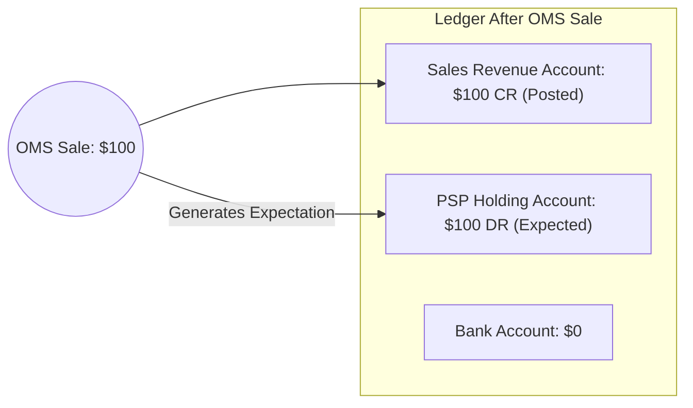
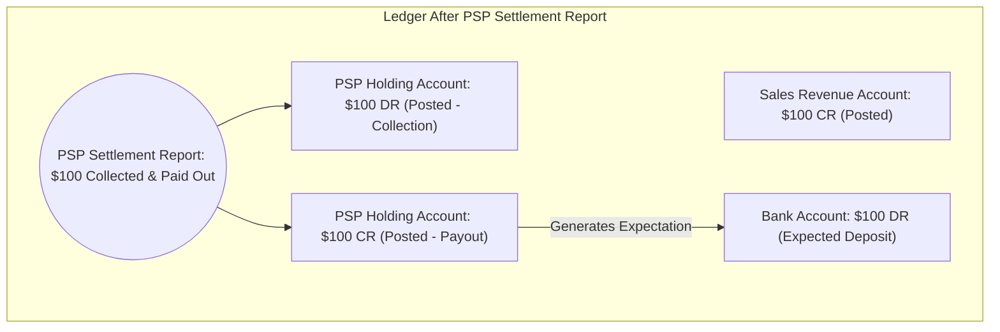
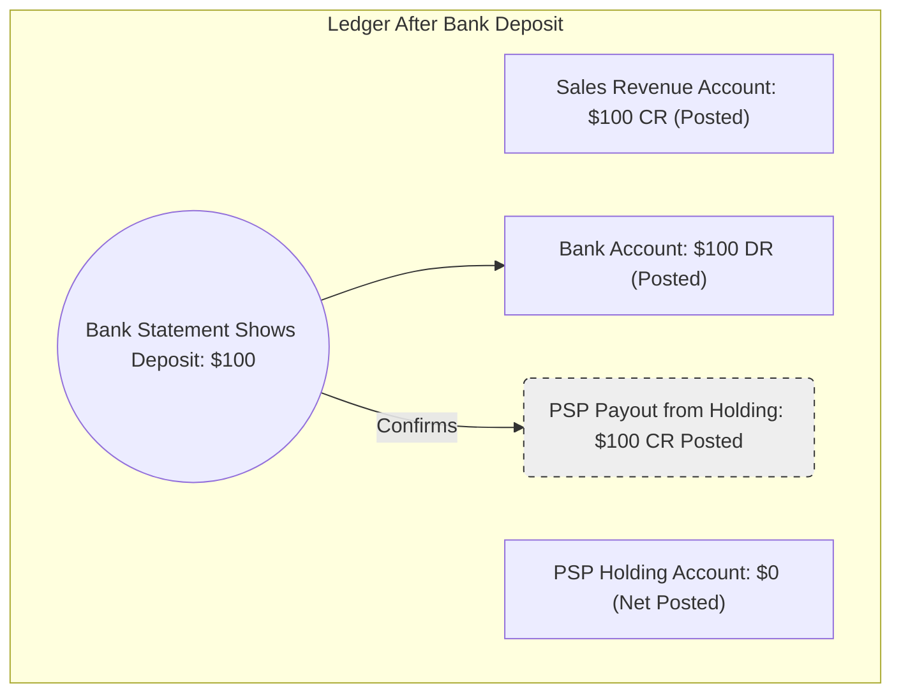
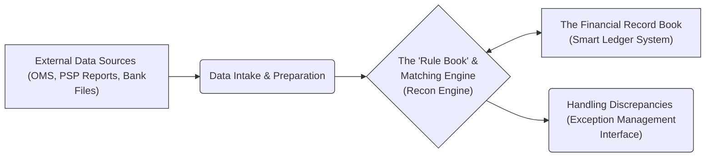

# Product Requirements Document: Accounting & Reconciliation Tool
## Empowering Your Business with Financial Clarity

## 1. Introduction: Solving the Reconciliation Puzzle

**What is this tool?**
This document outlines an intelligent accounting application designed to provide your business with clear, real-time financial visibility and to automate the often complex and time-consuming process of financial reconciliation.

**The Challenge We Address:**
Traditional reconciliation methods can be a significant drain on resources. They are often manual, leading to delays, potential errors, and a lack of immediate insight into your true financial position. This can hinder decision-making and operational efficiency.

**Our Vision: Reconciliation as a By-product:**
We believe that reconciliation shouldn't be a separate, arduous task. Our vision is an accounting system where reconciliation occurs naturally and seamlessly as financial data flows through a robust and intelligent ledger. If the ledger accurately reflects all financial movements and expectations, reconciliation becomes an inherent outcome.

**Building a Foundation for Growth: Beyond Reconciliation to Full Accounting:**
The sophisticated ledger system at the heart of this tool is not just for reconciliation. It's designed as a scalable foundation, paving the way for future expansion into comprehensive accounting functionalities, such as detailed financial reporting, payables/receivables management, and more, without requiring a fundamental redesign.

**Who is this document for?**
This document is intended for business leaders, product managers, finance teams, and anyone involved in understanding the strategic value and operational benefits of this new tool.

## 2. Understanding Our Approach: Key Concepts Made Simple

At its core, our system uses a "Smart Ledger" to keep track of all financial activities. Think of it like a highly organized and dynamic digital record book.

*   **Accounts:** Imagine these as clearly labeled "buckets" or categories for different types of money. For example:
    *   "Sales Revenue" (money earned from sales)
    *   "Money Held by Payment Processor" (funds collected by a PSP like Stripe or PayPal, but not yet in our bank)
    *   "Our Bank Account" (actual cash in our bank)

*   **Entries:** These are individual records of money moving into or out of these "buckets." Each entry specifies whether it's a credit or 
a debit for a particular account.

*   **Transactions:** A transaction tells the complete story of a financial event from start to finish. For instance, a single customer sale involves multiple steps (sale made, payment collected by PSP, money transferred to bank), and a transaction groups all the related entries for these steps together.

**How Data Flows & Matches:**
The system doesn't just record what happened; it's smart enough to anticipate what *should* happen next.
1.  When an event occurs (like a sale), the system records it.
2.  Based on pre-set rules, it then creates an "expectation" for the next step (e.g., expecting the PSP to collect the payment).
3.  When data for that next step arrives (e.g., the PSP confirms collection), the system matches this new information against its expectation.
This continuous process of recording, expecting, and matching ensures everything is accounted for.

## 3. Illustrative Example: The Journey of a $100 Sale

Let's walk through a common scenario to see how the system provides clarity and ensures every step is tracked.

**Initial Setup:**
*   Our Accounts: `Sales Revenue`, `PSP Holding Accout`, `Bank Account`. All start with $0.
*   Our Rules: The system knows that a sale will lead to PSP collection, and PSP collection will lead to a bank deposit.

---

**Stage 1: A Customer Makes a Purchase (Order System Data)**

*   **What happens:** A customer buys a product for $100. Our Order Management System (OMS) records this sale.
*   **Ledger Impact:**
    *   The $100 is immediately recognized as `Sales Revenue` (a credit, as revenue increases).
    *   Simultaneously, the system creates an **expectation**: it anticipates that our Payment Service Provider (PSP) will collect this $100 (an expected debit to the `PSP Holding Account`).
*   **Visibility:** The ledger instantly shows $100 in sales and $100 expected from the PSP.

---

**Stage 2: PSP Settlement Report Arrives (PSP Data)**

*   **What happens:** The PSP provides a **settlement report**. This report typically confirms two key actions:
    1.  The $100 from the customer's payment has been successfully collected into the merchant's account with the PSP.
    2.  The PSP has initiated the payout of this $100 (for simplicity, we're assuming no fees in this example) to the merchant's designated bank account.
*   **Ledger Impact:**
    *   **Collection Confirmed:** The system matches the settlement report to its initial expectation (the debit to `PSP Holding Account`). This $100 debit to the `PSP Holding Account` changes from `expected` to `posted`.
    *   **Payout by PSP Confirmed:** Based on the same settlement report indicating the payout, a $100 credit is also `posted` to the `PSP Holding Account` (representing money leaving the PSP's control and heading to the bank).
    *   **New Expectation for Bank Deposit:** With the payout from the PSP confirmed as initiated, the system now creates a clear **expectation** for $100 to arrive in `Our Bank Account` (an expected debit to the `Bank Account`).
*   **Visibility:** The ledger now shows:
    *   `Sales Revenue`: $100 CR (Posted).
    *   `PSP Holding Account`: $100 DR (Posted for collection) and $100 CR (Posted for payout), resulting in a net $0 balance in this account for this transaction.
    *   `Bank Account`: $100 DR (Expected Deposit).
    The system clearly indicates that the funds have moved through the PSP and are now anticipated in the bank.

---

**Stage 3: Money Arrives in Our Bank Account (Bank Data)**

*   **What happens:** Our bank statement arrives, showing a $100 deposit from the PSP.
*   **Ledger Impact:**
    *   The system matches the bank statement data to its expectation for the `Bank Account`. The $100 debit in the `Bank Account` changes from `expected` to `posted`.
    *   The corresponding expected payout (credit) from the `PSP Holding Account` also becomes `posted`.
*   **Visibility:** The journey is complete! The ledger shows:
    *   `Sales Revenue`: $100 (final).
    *   `PSP Holding Account`: $0 (money came in and went out).
    *   `Bank Account`: $100 (final, money received).

*(Note: PSP_H_Net_Credit represents the posting of the expected credit from Stage 2)*

---

**Outcome of the Example:**
Throughout this $100 sale's journey, the system provided an up-to-date view of where the money was and what was expected next. The final reconciliation (confirming $100 in sales led to $100 in the bank) happened automatically as each step was confirmed against expectations.

## 4. How We Ensure Accuracy and Trust (Key Principles)

Our system is built on principles that guarantee reliable and trustworthy financial data:

*   **Always Knowing What to Expect (Proactive Expectations):** The system doesn't just react to data; it anticipates future financial movements based on confirmed events and pre-defined business rules. This means we're always looking ahead.
*   **Matching Actuals to Expectations:** When new data arrives (e.g., from a PSP report or bank statement), the system diligently matches it against these pre-recorded expectations. This is the heart of automated reconciliation.
*   **No Data is Ever Lost (Immutability):**
    *   Financial records, once created, are not deleted.
    *   If a correction is needed, the original record is marked as "archived" (like putting a line through an old entry in a paper ledger but keeping it visible), and a new, correct record is created. This ensures a complete and transparent history.
*   **Balanced Books, Always (for Finalized Data):** For every financial event that is fully confirmed (`posted`), the total debits will equal the total credits. This fundamental accounting principle (double-entry) is enforced for all finalized transactions, ensuring the integrity of your financial records.

## 5. A Bird's-Eye View: System Components

While the inner workings are sophisticated, the system can be understood through a few key components:

*   **Data Intake & Preparation:** This part receives files from various sources (like your order system, payment processors, banks) and standardizes the data so the system can understand it.
*   **The "Rule Book" & Matching Engine (Recon Engine):** This is the brain. It uses pre-defined rules to understand what the incoming data means, create expectations, and match actual data to those expectations.
*   **The Financial Record Book (Smart Ledger System):** This is where all confirmed financial activities and active expectations are stored in an organized way (using Accounts, Entries, and Transactions).
*   **Handling Discrepancies (Exception Management):** If data comes in that doesn't match expectations or can't be processed by a rule, it's flagged here for review, ensuring nothing falls through the cracks.

## 6. Why This Matters: Benefits for Your Business

Implementing this Accounting & Reconciliation Tool offers significant advantages:

*   **Real-Time Financial Clarity:** Gain an instant and accurate understanding of your financial position, including expected incomings and outgoings.
*   **Reduced Manual Workload:** Automate the laborious and time-consuming tasks of data matching and reconciliation, freeing up your finance team for more strategic activities.
*   **Increased Accuracy:** Minimize the human errors often associated with manual data entry and reconciliation processes.
*   **Stronger Audit Trails:** Benefit from a complete, immutable history of every financial transaction and its journey through your systems, simplifying audits and compliance.
*   **Future-Proof: A Stepping Stone to Comprehensive Accounting:** The robust ledger architecture is designed for growth. This system can be extended in the future to include broader accounting functionalities (like generating Profit & Loss statements, Balance Sheets, managing payables/receivables, and full general ledger reporting) without needing to rebuild the core.
*   **Better, Faster Decisions:** Make informed business decisions based on reliable, up-to-date financial data.

## 7. Glossary of Simple Terms (Optional)

*   **Account:** A category for tracking a specific type of financial asset (like cash in bank), liability (money owed), income, or expense.
*   **Entry:** A single record of a financial movement, either increasing (credit for revenue/liability) or decreasing (debit for revenue/liability) an account's balance.
*   **Transaction:** A set of related entries that represent a complete financial event (e.g., a sale from order to cash in bank).
*   **Posted:** An entry or transaction that is confirmed, final, and officially part of your financial records.
*   **Expected:** An entry or transaction that the system anticipates will occur based on rules and prior events.

---

This document provides a high-level overview. Further details on specific functionalities and technical aspects can be provided as needed.